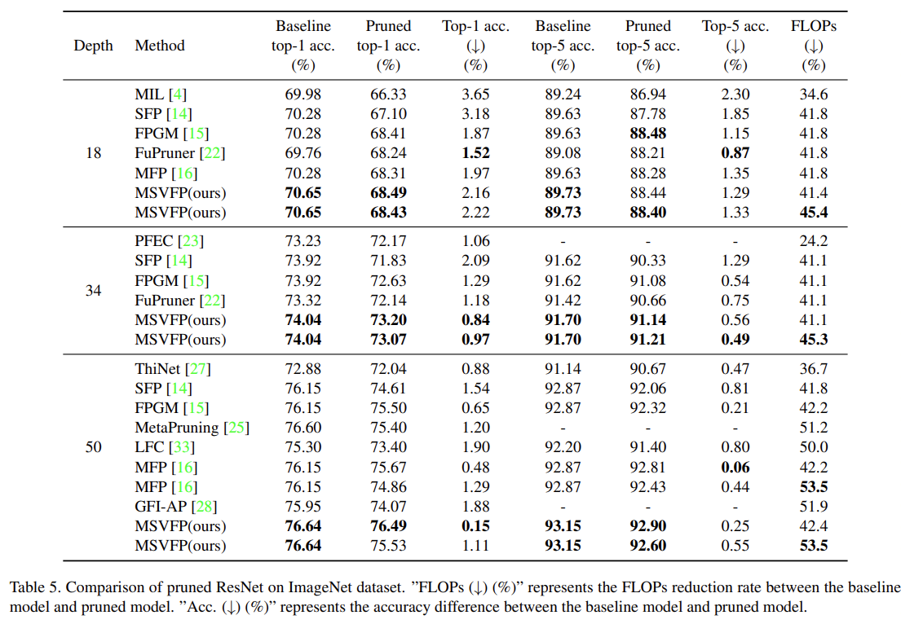

# Magnitude and Similarity based Variable Rate Filter Pruning for Efficient Convolution Neural Networks

**Code for: Ghimire, D.; Kim, S.-H. Magnitude and Similarity Based Variable Rate Filter Pruning for Efficient Convolution Neural Networks. Appl. Sci. 2022, 13, 316. https://doi.org/10.3390/app13010316**  

Pruning the selected set of filters & restructuring the network is based on [VainF/Torch-Pruning](https://github.com/VainF/Torch-Pruning).

## Table of Contents

- [Requirements](#requirements)
- [Models](#models)
- [VGGNet on CIFAR10](#vggnet-on-cifar10)
  - [Training]()
  - [Pruning]()
  - [Evaluation]()
- [ResNet on ImageNet](#resnet-on-imagenet)
  - [Prepare ImageNet dataset]()
  - [Training]()
  - [Pruning]()
  - [Evaluation]()
- [ResNet on CIFAR-10](#resnet-on-cifar10)

## Requirements
- Python 3.9.7
- PyTorch 1.10.2
- TorchVision 0.11.2
- matplotlib 3.5.1
- scipy 1.8.0

`Note: These are the verified version of the tools used in the experiment. You can test with other versions as well.` 

## Models 

The trained baseline models are uploaded in [baseline_models](https://drive.google.com/drive/folders/1unWBIVZ997kCHQnOUrfvgjfvWLi4JoHO?usp=sharing) and corresponding pruned models are uploaded in [pruned_models](https://drive.google.com/drive/folders/1umLOZK4VISA6SOi0oseO76i-IaiTPuIx?usp=sharing). The code and models for ResNet in CIFAR10 needs some cleanup and will be released later. 

## VGGNet on CIFAR10

The CIFAR-10 dataset will be downloaded automatically when we run the script for the first time. No extra step is required to manage this dataset.  

The file [main_vgg_cifar10.py](./main_vgg_cifar10.py) is used for training, pruning, and evaluating VGGNet in the CIFAR-10 dataset. 

**Training**

```ruby  
python main_vgg_cifar10.py  --dataset cifar10 --depth 16 \
        --mode train \
        --save_path "./save/path/" \
        --total_epoches 160 \
        --schedule 40 80 120 \
        --gammas 0.2 0.2 0.2 \
        --lr 0.1 --decay 0.0005 --batch_size 256
```
Also, script [scripts/run_vgg16_cifar10_baseline_train.sh](./scripts/run_vgg16_cifar10_baseline_train.sh) can be used for training. In the case of the CIFAR-10 dataset, an average of three experiments are used for evaluation. 

**Pruning**

```ruby
python main_vgg_cifar10.py  --dataset cifar10 --depth 16 \
        --mode prune \
        --pretrain_path "./pretrain/path/" \
        --save_path "./save/path/" \
        --method mix \
        --rate_flop 0.342 \
        --total_epoches 160 \
        --schedule 40 80 120 \
        --gammas 0.2 0.2 0.2 \
        --lr 0.01 --decay 0.0005 --batch_size 256
```
Also, refer to the script [scripts/run_vgg16_cifar10_pruning.sh](./scripts/run_vgg16_cifar10_pruning.sh) for more detail instructions. 

**Evaluation**

```ruby
# you can directly run this script for evaluation of one vgg16 model. 
# pruned model is present in the given path. 
python main_vgg_cifar10.py  --dataset cifar10 --depth 16 \
        --mode eval \
        --depth 16 \
        --pretrain_path "./baseline_models/CIFAR10-VGG16_BASELINE/vgg16_round_1/model_best.pth.tar" \
        --pruned_path "./pruned_models/CIFAR10-VGG16-PRUNED/vgg16_round_1_flop_0.342/model_best.pth.tar" \
        --save_path "./eval_pruning_cifar10_vgg16" 
```
Also, refer to the script [scripts/run_vgg16_cifar10_pruning_eval.sh](./scripts/run_vgg16_cifar10_pruning_eval.sh) for more detail instructions. 

## ResNet on ImageNet

The file [main_resnet_imagenet.py](./main_resnet_imagenet.py) is used for training, pruning, and evaluating ResNets in the ImageNet dataset. 

### Download and prepare ImageNet dataset

1. Download the images from http://image-net.org/download-images

2. Extract the training data:

```ruby
mkdir train && mv ILSVRC2012_img_train.tar train/ && cd train
tar -xvf ILSVRC2012_img_train.tar && rm -f ILSVRC2012_img_train.tar
find . -name "*.tar" | while read NAME ; do mkdir -p "${NAME%.tar}"; tar -xvf "${NAME}" -C "${NAME%.tar}"; rm -f "${NAME}"; done
cd ..
```

3. Extract the validation data and move images to subfolders:

```ruby
mkdir val && mv ILSVRC2012_img_val.tar val/ && cd val && tar -xvf ILSVRC2012_img_val.tar
wget -qO- https://raw.githubusercontent.com/soumith/imagenetloader.torch/master/valprep.sh | bash
```

Note: Here we suppose the ImageNet dataset is stored in `"C:/ImageNet"` directory. 

**Training**

```ruby
python main_resnet_imagenet.py  --data_path "C:/ImageNet" \
        --mode train \
        --arch resnet18 \
        --save_path "./save/path/" \
        --total_epoches 100 \
        --decay_epoch_step 30 \
        --workers 8 \
        --lr 0.1 --decay 0.0001 --batch_size 256
```

Also, refer to the script [scripts/run_resnet_imagenet_baseline_train.sh](./scripts/run_resnet_imagenet_baseline_train.sh) for more detail instructions. 

**Pruning**

```ruby
python main_resnet_imagenet.py  --data_path "C:/ImageNet" \
        --mode prune \
        --arch resnet18 \
        --pretrain_path "pretrain/path" \
        --save_path "save/path" \
        --method mix \
        --rate_flop 0.41 \
        --total_epoches 100 \
        --start_epoch 20 \
        --recover_epoch 2 \
        --retrain_step_flop 0.03 \
        --decay_epoch_step 30 \
        --workers 8 \
        --lr 0.01 --decay 0.0001 --batch_size 256
```
Also, refer to the script [scripts/run_resnet_imagenet_pruning.sh](./scripts/run_resnet_imagenet_pruning.sh) for more detail instructions. 

**Evaluation**

```ruby
# you can directly run this script for evaluation of one resnet50 model. 
# pruned model is present in the given path. 

# even if you do not have the ImageNet dataset, you can still calculate FLOPs reduction rate

python main_resnet_imagenet.py  --data_path "C:/ImageNet" \
        --mode eval \
        --arch resnet50 \
        --pretrain_path "./baseline_models/ImageNet-RESNET-BASELINE/resnet50/resnet50.model_best.pth.tar" \
        --pruned_path "./pruned_models/ImageNet-RESNET-PRUNED/resnet50_flop[0.42]/resnet50.model_best.pth.tar" \
        --save_path "save/path" \
        --workers 8 \
        --batch_size 256
```

Also, refer to the script [scripts/run_resnet_imagenet_pruning_eval.sh](./scripts/run_resnet_imagenet_pruning_eval.sh) for more detail instructions. 



## ResNet on CIFAR-10

-- TODO

## How to Cite this Work? 

```ruby
@article{ghimire2023magnitude,
  title={Magnitude and Similarity Based Variable Rate Filter Pruning for Efficient Convolution Neural Networks},
  author={Ghimire, Deepak and Kim, Seong-Heum},
  journal={Applied Sciences},
  volume={13},
  number={1},
  pages={316},
  year={2022},
  publisher={Multidisciplinary Digital Publishing Institute}
}
```
